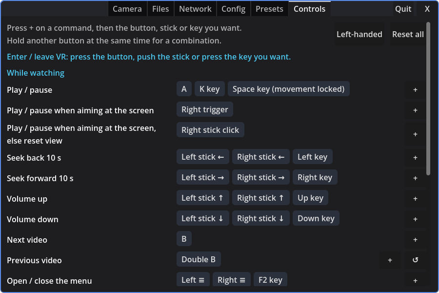
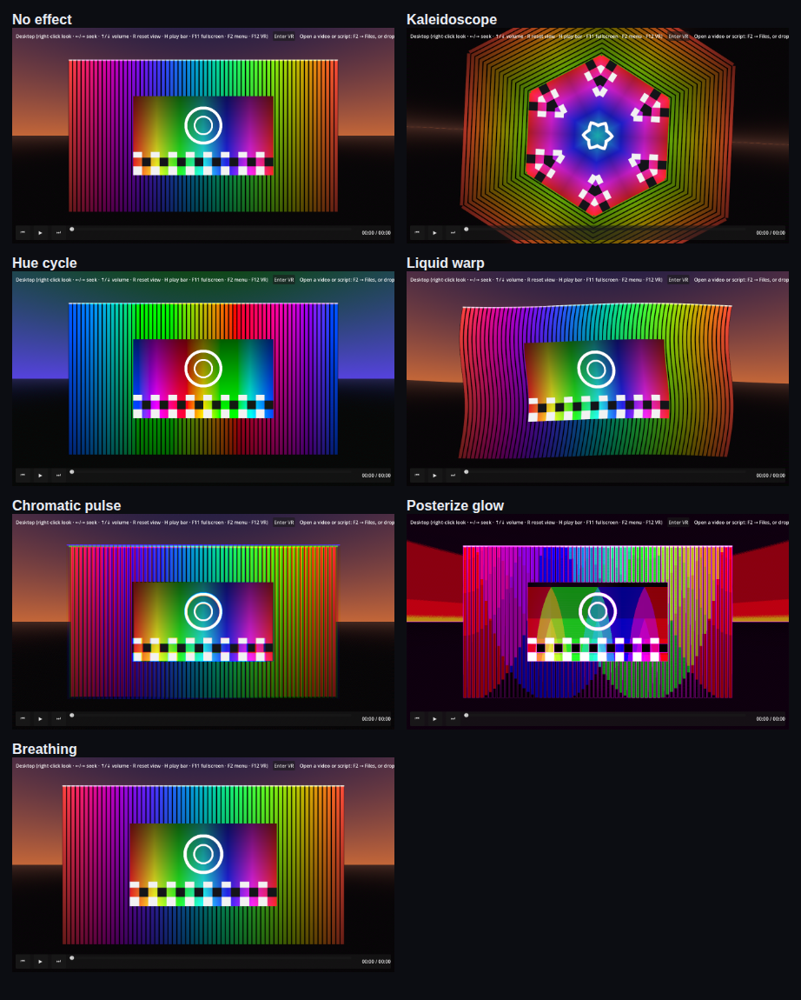
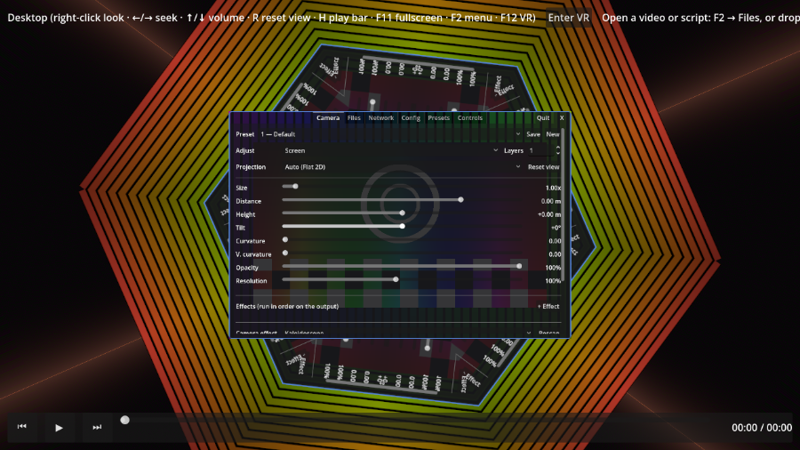
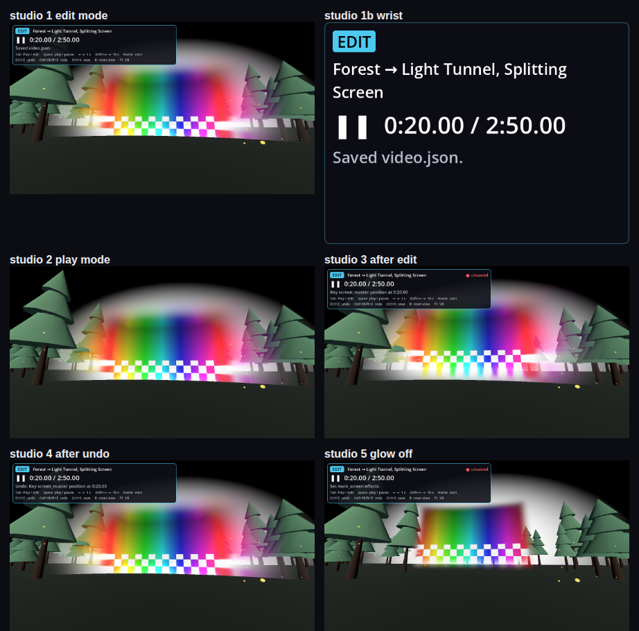
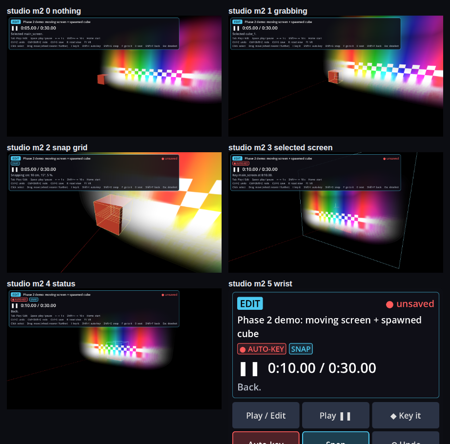

# Scripted VJ Video Player

A scripted, VJ-style video player built in Godot 4.4. Music video plays while a JSON script drives keyframed events on top of it — screen/projection transforms, spawning and moving objects, and shaders on cameras and objects. VR-capable via OpenXR.

See [Scripted VJ Video Player — Project Plan.md](./Scripted%20VJ%20Video%20Player%20%E2%80%94%20Project%20Plan.md) for the full plan.

## Repository layout

- `player/` — the standalone runtime (main scene, script format, evaluator, VR)
- `addons/vj_editor/` — the Godot editor plugin (timeline dock, track editors)
- `examples/` — sample scripts
- `tests/` — GUT unit tests
- `docs/` — schema reference, authoring guide, player usage

## Status

**Phase 0 — Foundation.** Project scaffold in place; minimal scene loads and parses a script. Video decoding on Windows and OpenXR sanity check still to be validated.

## Using it as a VR media player

Open a video or a script from **F2 → Files**, by dropping it on the window, or with `--script <file>`. A plain video plays on the default screen; a same-name `.json` next to a video (`clip.mp4` + `clip.json`) is used as its script. A script that spawns its own `main_screen`, or sets `"meta": {"default_screen": false}`, replaces the default screen.

- **Network (DLNA):** **F2 → Network** lists DLNA/UPnP media servers on the LAN (MiniDLNA, Plex, Jellyfin, Serviio, Windows Media sharing, …); browse folders and pick a video to stream it. `http(s)://` URLs also work anywhere a video path does (`--script <url>`, a script's `media.video`).
- **Thumbnails:** Files and Network show the thumbnails the OS or server already has. On Windows these are Explorer's, via a small background PowerShell helper. On Linux they come from the freedesktop cache, and for DLNA they're the server's album art or `JPEG_TN` images. The player never generates its own. The **Tiles / List** button switches the layout for both tabs, and the choice is remembered.
- **Projection** is detected from the filename (for DLNA items, from the title) (`_180`, `_360`, `_LR`/`_SBS`, `_TB`/`_OU`, …) and can be overridden in **F2 → Camera**.
- **Movement** is locked by default (**F2 → Config**). While locked, the thumbsticks seek ±10 s (left/right) and change volume (up/down). Right stick click resets the view, right **A** plays/pauses. Desktop: ←/→ seek, ↑/↓ volume, Space/K play/pause, R reset view.
- **Controls:** every button, stick and key above is a default. **F2 → Controls** lists each command with its bindings. Press **+** and then the button, stick or key you want, hold another button at the same time for a combination (e.g. left trigger + A), or open a binding to make it a hold or double press or to remove it. An input another command had moves over, and the tab says from where. **Left-handed** swaps every default left for right, **↺** and **Reset all** go back to the defaults. Your changes are saved in `user://input_bindings.json`.

  
- **Presets and scripts:** your screen presets (size, distance, curvature, effects, layers) apply to plain videos. A script plays with the locked preset 0, **Script (defaults)**, so it looks the way it was authored; your previous preset comes back when you open a plain video. You can still adjust sliders or pick a preset by hand during a script.
- **Shader layers:** **F2 → Camera → Layers** sets how many sound-reactive shader layers there are (0 to start). **Adjust** picks the screen or a layer; for a layer, pick its shader from the Shader dropdown and the sliders move that layer relative to the screen (layers are attached to the screen, so moving or animating the screen carries them along), and presets save everything. Layers and the video draw back to front by depth, so **Distance** decides what's in front: a new layer sits just in front of the video (later layers slightly further forward), and pushing it back puts it behind. **Lock to screen** keeps a layer centred on the video screen, following it wherever it moves, at its own size; Distance then moves it in front of or behind the screen. To fill the whole view, set a layer's size high and use **Curvature** and **V. curvature** together, which bow it into a dome around you. Two shaders are built in. To add more, drop Shadertoy code as-is (the `mainImage` function, saved as `.glsl`) into `%APPDATA%\Godotpp_userdata\Scripted VJ Video Player\shaders\` or a `shaders` folder next to the `.exe`. `iChannel0` is the music input (Shadertoy's 512×2 spectrum and waveform texture), and `iTime` and `iResolution` work. Mouse, keyboard, texture channels and multipass buffers don't. Godot `canvas_item` shaders (`.gdshader`) work too, and can include `res://player/visualizer/shadertoy_prelude.gdshaderinc` for the same inputs plus `audio_bass` / `audio_mid` / `audio_high` / `audio_level`.
  - **Shader hints:** a comment `// @resolution 1024x1024` sets the pixel size a layer renders at, and its screen takes that shape (square, here); the default is 960×540. Every `uniform float`/`int` with a `hint_range(min, max[, step])`, and every `uniform bool`, gets a slider or checkbox under the layer's sliders, saved in presets.
  - **Video input:** a comment `// @iChannel1 video` (any of iChannel0–3) feeds that channel the playing video's frame, top row at v = 0; iChannel0 stays the audio unless tagged. The layer then takes the video's shape and stereo layout like the main screen (for stereo, the whole frame goes in and the output is split per eye; `video_stereo` is 0 mono / 1 side-by-side / 2 top-bottom, so blurs can clamp to one eye), so **Lock to screen** at size 1 lines it up with the video. `// @resolution 270` gives just a height, the width following the shape. The built-in **Video blur** does this at 270 px tall: lock it a little behind and larger than the screen, and put **Edge blur** on the screen, for a glow around the video.
- **Effects:** the screen and every layer have an effect list (**+ Effect**, then pick one; **−** removes it). Effects run in order on the output (the video, or the layer's shader) and each gets its own hint controls. Built in: **Key black** (black becomes transparent, for laying a shader over the video) and **Oval mask** (sets the alpha on one side of an oval to 0 = cut away or 1 = solid, with size, ratio and blur; a blurred mask on the screen fades the video into the layers behind it) and **Edge blur** (blurs the alpha to soften whatever edges earlier effects or the shader cut out, over a set radius; *inward* keeps the fade inside the shape, off centres it on the edge) and **Padding** (a transparent margin, *amount* × the picture's height on each side: the effects after it, and the screen, grow by it while the picture keeps its size, so an outward Edge blur or a Glow isn't cut off at the edge; flat screens only) and **Glow** (a bright, blurred reflection of the picture in its own edge as a halo, plus an inner glow along the edge; put Padding before it, the halo draws in its margin) and **Crop** (shows a sub-rectangle of the picture over the whole screen, e.g. one third for split screens; put it first) and **Rounded corners** (cuts the picture's corners round in alpha, with separate x and y radius for elliptical corners; an Edge blur after it softens them) and **Keep center** (for a scaled-up screen or layer: set *zoom* to its Size and the middle *center* part of the picture stays about its original size while the rest stretches out to the edges; *softness* blends the two, *horizontal* / *vertical* pick the axes). On stereo video effects run per eye. To write one, make a `.gdshader` that includes `res://player/visualizer/effect_prelude.gdshaderinc` and samples `input_tex` at `UV` (`display_aspect` is the screen's width / height); it goes in the same `shaders` folder and shows up in the effect picker instead of the shader list.
- **Camera effects:** a shader over *everything* you see (the video, the layers, the world), under **F2 → Camera → Camera effect**: pick one, set its **Strength** and its own sliders; it's saved with the preset. Built in: **Kaleidoscope**, **Hue cycle**, **Liquid warp**, **Chromatic pulse**, **Posterize glow** and **Breathing**, all nudged by the music's bass. The menus stay readable: the effect leaves the F2 panel and the wrist HUD alone. **F2 → Config → Camera effects** turns them off altogether or caps their strength (**Effects at most**), for presets and scripts alike. They need the Forward+ renderer (the player's default).

  
  

  To write one, make a GLSL file with a `// @camera` line and a `vec3 camera_fx(vec2 uv)` function, and put it in a `shaders` folder (`.glsl`, `.frag` or `.txt`); **Rescan** picks it up:

  ```glsl
  // @camera
  uniform float amount : hint_range(0.0, 0.1, 0.001) = 0.02;
  vec3 camera_fx(vec2 uv) {
      // uv: 0..1 across the view, top-left origin
      float wave = sin(uv.y * 40.0 + iTime * 3.0) * amount * (1.0 + audio_bass);
      return view_color(uv + vec2(wave, 0.0));
  }
  ```

  Available: `view_color(uv)` (what was rendered), `iTime`, `iResolution`, `eye` (0 left, 1 right in VR), `strength`, `audio_level` / `audio_bass` / `audio_mid` / `audio_high`, and `audio_spectrum(x)` (0–11 kHz across 0..1). `uniform float|int|bool` lines with a `hint_range` get sliders, like layer shaders. The result is blended over the view by Strength, so you don't need to handle it. If it doesn't compile, the Camera tab shows the error with the line number in your file. In VR, warp both eyes the same way (don't make the effect depend on `eye`) and avoid big flashes faster than three a second.
- **Script cuts:** a script's cuts move you to where its author placed the viewer. Seeking puts you at the cut in effect at the new time (or back home before the first one), so seeking back past a cut undoes it; a seek that stays between the same two cuts leaves you where you are. **F2 → Config → Script camera** turns cuts off.
- **Skybox** is black by default; other options, plus any panorama images in the `skyboxes` folders listed in **F2 → Config**.
- **FPS:** **F2 → Config → FPS** shows the frame rate at the start of the desktop top bar and on the wrist HUD.
- **Fullscreen / play bar:** **F11** toggles fullscreen and **H** hides or shows the bottom play bar on the desktop window. Both are also in **F2 → Config**, and they stay set the next time you open the player.
- **Timecode:** a Whirligig-compatible server runs on `127.0.0.1:2000` for MultiFunPlayer / ScriptPlayer. `--whirligig-port N` changes it (0 = off), `--whirligig-lan` accepts other machines.

## Studio (the VR editor, early)

Studio opens a script and lets you change it from inside the headset, on the player's own renderer, so what you see while editing is what the player will show. It's being built in steps (see [VR Studio — Plan.md](./VR%20Studio%20%E2%80%94%20Plan.md)); so far it opens a piece, plays and scrubs it, switches between Play and Edit, selects and moves things by hand (keyed or not), undoes and redoes, and saves. An inspector for configs and effects comes next.

- **Start it** from the same build as the player, with Studio's scene and the piece: `VRmviewer.exe res://studio/studio.tscn -- --piece path\to\video.json` (or `build_and_run.bat studio [video.json]`). A video with a same-name `.json` next to it works as the piece too; `--start <seconds>` opens at that time, `--vr` / `--desktop` as in the player.
- **Play and Edit:** Play is the audience view with nothing added. Edit shows the piece's name, the time, whether there are unsaved changes and what just happened, on the left wrist in the headset and in the corner of the desktop window. Switching keeps the playhead.
- **Controls** (defaults; Studio's own, separate from the player's):

  | | Headset | Keyboard |
  |---|---|---|
  | Play / Edit | left ≡ | Tab |
  | Play / pause | A | Space, K |
  | Step 1 s | | ← → |
  | Seek 10 s | right stick ← → | Shift+← → |
  | Scrub (Edit; further = faster) | left trigger + left stick | |
  | Go to the start | | Home |
  | Undo / redo (Edit) | B / hold B | Ctrl+Z / Ctrl+Shift+Z, Ctrl+Y |
  | Save | | Ctrl+S |
  | Reset view (the home seat) | right stick click | R |
  | Enter / leave VR | | F1 |
  | **Edit mode:** | | |
  | Select what you point at | right trigger | left click |
  | Grab and move (hold) | right grip | left drag |
  | Both hands: scale and turn | left grip too | |
  | Push / pull while grabbing | right stick ↑ ↓ | mouse wheel while dragging |
  | Key the selection here | A | I |
  | Auto-key on / off | wrist | Shift+I |
  | Snapping on / off | wrist | Shift+G |
  | Go to the selection / back | wrist | F / Shift+F |
  | Audience seat | wrist | 0 |
  | Deselect | wrist | Esc |
  | Fly (where you look) | left stick | WASD, E / Q |
  | Snap turn / rise, sink | right stick ← → / ↑ ↓ | |

  In Edit mode A and the right stick key and fly instead of playing and seeking; play from the wrist or scrub with left trigger + stick. On the desktop the right mouse button looks around.
- **Moving things:** point and pull the right trigger to select (a yellow box with its axes), hold the grip to carry it; the left grip as well scales and turns it with both hands. One grab is one undo step. With **auto-key** off (the default), a move changes where the object is placed, or, if it's already animated, shifts its whole path so the motion keeps its shape. With auto-key on (red chip), a move keys position / rotation / scale at the playhead. **Snapping** (blue chip) rounds to 10 cm, 15° and 5 % and shows a grid while you carry. The wrist palette (left wrist) has buttons for all of it, plus undo, redo, save and the seat, which puts you where the audience is at this moment (marked in the world with a ring and an arrow).
- **Saving:** Ctrl+S writes the piece back to its `.json`, after checking it with the player's own validator (an edit that would make it invalid isn't saved, and the status says why). Opening and saving without changes, or after undoing them all, leaves the file byte for byte as it was. After edits it's written with the file's own indentation and key order; a version 1 script is saved as version 2. There's no autosave yet, and closing Studio doesn't ask about unsaved changes.
- Studio doesn't follow changes other programs make to the file while it's open (a Godot export, say); reopen the piece to see them.





## Prerequisites

- Godot 4.4 stable (Windows binary at `C:\ProgramData\chocolatey\lib\godot\tools\Godot_v4.4-stable_win64.exe` in this dev environment)
- For MP4 playback: [`godot-videodecoder`](https://github.com/EIREXE/godot-videodecoder) addon — see [`docs/videodecoder_install.md`](./docs/videodecoder_install.md)
- For VR: SteamVR or another OpenXR runtime

## Installing godot-xr-tools

`godot-xr-tools` is not tracked in this repo (release binaries required). Install it manually before opening the project:

1. Download the latest release from https://github.com/GodotVR/godot-xr-tools/releases
2. Extract the `addons/godot-xr-tools/` folder into `project_engine/addons/godot-xr-tools/`
3. Open the project in Godot — the addon should be picked up automatically
