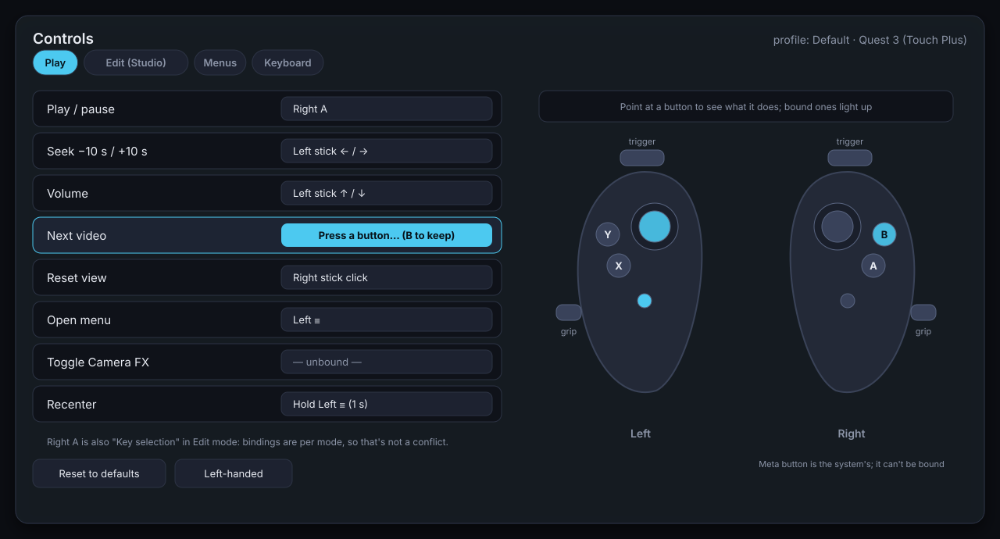

# VR Studio — Plan and handoff

Plan for a VR editor ("Studio") for VJ scripts: build and perform a piece from inside the headset. This records the decisions made so far, what's done, and the design and milestones for what comes next, so work can resume in a fresh session. The design is under *Studio design*.

Branch: `claude/sweet-bardeen-mjgzvk`.

## Working with the user
- **Show pictures between steps.** The user likes seeing rendered screenshots as work goes, not just at the end. After each visible change, render it (`tools/cloud/run.sh`, see *Working in the cloud container*), look at the images yourself first (fix anything off), then send them (SendUserFile, `display: render`), several at once as a contact sheet (`tools/cloud/sheet.sh`). Real renders beat mockups; mockups (`docs/studio/*.svg`) only for things that don't exist yet.
- **No headset available to check.** The user can't test VR right now, only look at pictures. So everything is proven with tests, driving the real main scene, and renders; say plainly what couldn't be verified (VR, two-eye rendering, controller feel, frame rate on the Quest 3).
- **Target:** Quest 3 over Link / Air Link / Virtual Desktop to a Windows PC.
- Commit and push each milestone to the branch with docs updated (README for user-facing features, this file for status).

## Decisions

1. **The script JSON is the master format**, not a Godot source project.
   - The VR editor runs on the player's own renderer, so what you see in the headset is what the player shows. That's the reason VR editing is worth doing at all.
   - The format is now lossless for animation (bezier handles, true cubic; see *Done*), which was the main argument against it.
   - It keeps the plan's founding goal: scripts can be edited by hand, diffed and shared as a zip, with no Godot install needed.
2. **A Godot scene is a view of the JSON, never a second master.**
   - Import only into an **empty project**; there is never any merging into an existing scene.
   - The imported scene's `output_path` points back at the JSON, so exporting writes the master.
   - Rule for artists: anything that must survive belongs in the JSON or inside a prefab. Loose scene furniture is lost on the next round trip.
3. **Studio is a separate app, but not a separate codebase.**
   - It has its own main scene and export preset in `project_engine/`, and shares the player's rendering core.
   - Dependencies go one way: `studio/` uses `player/stage/`, and nothing in `player/` references `studio/`.
   - Studio doesn't need DLNA, the playlist, Whirligig or live sync.
4. **Studio edits the JSON directly**, reusing the player's existing load, hot-reload and reconcile path. Live sync with the Godot editor isn't needed for it.

Rejected alternatives, and why:
- **Studio inside the addon, editing `.tscn` at runtime:** it would render with the addon's preview copies rather than the player, and saving a scene at runtime is risky (owners, instances, local-to-scene materials).
- **Merging a JSON into an existing scene:** it's a 3-way merge; not worth it.
- **Existing runtime-editor addons:** we checked Godot4xGizmo, 3D Gizmo Tool, DsInspector, Inspector Gadget, and the Godot editor running on Quest. None handle "change → keyframe at the current time → persist", and the Quest editor is standalone Android while gde_gozen is a Windows FFmpeg extension. Use **XR Tools** instead: `XRToolsPickable` for grabbing, `XRToolsInteractableHinge` / `Slider` / `Joystick` for knobs and faders, and `Viewport2DIn3D` for wrist panels.

## Done

### Script format v2 (`8a44787`)
- **Interpolation modes:** `interp` can be `linear` (default), `step`, `ease` (per-segment smoothstep), `cubic` or `bezier`.
  - `cubic` is Godot's time-aware Catmull-Rom (`cubic_interpolate_in_time`).
  - `bezier` keys carry `in` / `out` handles as `[dt, dv]` relative to the key, one pair per element for arrays. The player solves them exactly as Godot's `bezier_track_interpolate` does (10-step bisection).
- **v1 files still load:** their `cubic` is rewritten to `ease` on load (`ScriptFormat._upgrade`), because v1's cubic was a smoothstep. The player accepts versions 1–2; exporters write 2.
- **Exporter no longer bakes bezier tracks.** Where components have keys at different times, each curve is split exactly with de Casteljau; segments with flat handles export as `linear`.
  - Forest tunnel: 174 KB (2,080 keys) → 37 KB (175 keys), now exactly the editor's curves.
- **Previous mismatch fixed:** the player's `cubic` used to be a smoothstep while Godot's is a spline, so motion differed from the editor. They now match.
- **Tests:** `project_engine/tests/test_interpolation.gd` compares against Godot's own `Animation` interpolation (cubic within 1e-4, bezier within 1e-5).

### Importer and format gaps (`04f3be3`)
- **Importer:** `addon_vj/importer/script_importer.gd`, the exporter in reverse.
  - **Tools > VJ: Import script.json…** (or `importer/run_import.gd -- <json>` headless) writes `res://main.tscn`, makes it the main scene, and copies custom prefabs to `prefabs/` and shaders to `shaders/`.
  - It refuses a project that already has scenes outside `addons/`.
- **What converts exactly:** everything the exporter writes. Hand-written-only features are converted or dropped with a warning:
  - an `ease` track, or one mixing interpolations → Bezier tracks with equivalent handles (ease and cubic segments convert exactly)
  - `step` mixed with other modes → holds until 1 ms before the next key
  - an object respawned with a different config → keeps its first spawn's
  - cuts with different transitions → all get the first one's (the scene's viewer has one)
  - `vr_teleport`, top-level `objects` (the player ignores these too) and `media.audio` → dropped
- **Format gaps closed:**
  - Switched-off effects export as `"enabled": false`. The player skips them and doesn't count them in `effect<N>`.
  - A viewer start pose away from home (0, 2, 8) exports as a hard `vr_cut` at t=0.
- **Round-trip test:** `addon_vj/tests/run_roundtrip.gd` imports and exports every JSON in `scripts/` and `addon_vj/tests/fixtures/` twice. It fails if playback differs (every track sampled through the player's `Interpolation`) or the export changes on the second pass.
  - All pass, including a hand-written fixture that covers every conversion.
  - I broke the importer on purpose to confirm the test catches it.
  - Forest tunnel imported, saved to `.tscn`, reloaded and exported with 0 differences from the original.

### Controls and remapping in the player (milestone IN)
- **Commands, contexts, bindings:** `player/input/input_bindings.gd` has the 18 player commands, the contexts (menus > free > locked > play; the highest active context that uses an input owns it, a stick counting as one input), and default bindings that reproduce the player's old hard-coded buttons exactly. Only the user's changes are saved (`user://input_bindings.json`); changes for commands a version doesn't know are kept.
- **Router:** `player/input/input_router.gd` polls the controllers (Godot's generic OpenXR actions, analog trigger / grip with hysteresis) and takes keys from `_unhandled_input`. It handles press / hold / double press, chords (a held modifier), stick flicks with rearm, and axis commands (walk, turn, scroll). Rebinding captures the next press; presses in its first 0.2 s are ignored, because in VR the trigger that clicked "+" can arrive just after the click.
- **Player wired onto it:** `xr_rig.gd` no longer interprets buttons (it only sets the "menus" context while the laser is on a panel), `xr_movement.gd` reads the router's axes, and `main.gd` handles commands. The `toggle_vr` / `toggle_panel` InputMap actions are gone (F1 / F2 are bindings now).
- **Controls tab** (F2 → Controls): commands grouped by when they apply, a chip per binding (its menu: press / hold / double, remove), **+** to capture, per-command ↺, Left-handed and Reset all (both need a second press). Taking an input moves it from the command that had it, and says so; clashes show in red.
- **Tests:** `tests/test_input.gd` (14 tests) covers the defaults, contexts, gestures, chords, flicks, keys, capture, conflicts, saving and left-handed.
- **Checked beyond the tests:** the real main scene booted with every command fired and keys pushed through `_unhandled_input`, and the Controls tab rebound a command end to end; screenshots rendered under Xvfb (`docs/player/controls_tab.png`). **Not yet tried on a headset.**
- **Left for later:** the controller picture from the mockup (pointing at a button shows what it does), saving your own named profiles, and Studio's own contexts (M2).

### Camera shaders in the player (milestone FX)
- **How they render:** not the quad planned below. Godot captures the screen texture *before* transparent objects, and the video screen and layers draw with transparency, so a quad reading it would warp the world but not the video. Instead `player/visualizer/camera_fx_effect.gd` is a **`CompositorEffect`** on the WorldEnvironment (after transparent objects): per eye (`get_view_count()`), a compute pass copies the image, then the effect's compute shader writes the result. It needs Forward+ or Mobile (RenderingDevice); on Compatibility it doesn't run.
- **Effects are GLSL** (compute shaders can't use Godot's shading language): a `// @camera` file with `vec3 camera_fx(vec2 uv)`. `camera_fx_shaders.gd` wraps it, turning `hint_range` uniforms into reads from a storage buffer (so they get the same sliders as layers) and mapping compile errors back to the file's own line numbers. Six built-ins live there as constants: kaleidoscope, hue cycle, liquid warp, chromatic pulse, posterize glow, breathing.
- **Menus stay readable:** the F2 panel's and the wrist HUD's quads are projected to each eye's image every frame and skipped by the pass.
- **Where it lives:** `CameraFx` (`camera_fx.gd`) picks what shows. A playing script's `camera` block wins, else the preset's (`LayerStack.camera_fx`, saved as `camera_fx` in presets). It applies the Config limits (`camera_fx` on/off, `camera_fx_max`) and keeps the audio analyzer running while it's on. The Camera tab has a *Camera effect* section (picker, Strength, the effect's sliders, compile errors); the Config tab has *Camera effects* and *Effects at most*.
- **In scripts:** top-level `"camera": {"effects": [{"shader", "params", "strength", "enabled"}]}` (shader keys in `shaders`; `"builtin:kaleidoscope"` works as a value), and `shader_param` tracks on `$camera.effect0`, including `strength`. It's an addition to format 2 (older players ignore it), so no version bump. Only the first enabled effect runs.
- **Tests:** `tests/test_camera_fx.gd` (10) covers compiling, sources and params, error lines, file discovery, settings and presets, limits, and the script block and tracks.
- **Checked by rendering** under Xvfb with Mesa's software Vulkan (lavapipe): every built-in compiles and renders over the real main scene, the open menu stays untouched, a broken user file shows `line 4: 'wobbel' : undeclared identifier`, and a script's camera block overrides the preset with its strength track and the user's cap applied. Screenshots in `docs/player/`. **Not tried in a headset:** the per-eye path (two views) is written for multiview but only one view ran here.
- **Left for later:** several effects at once (chaining), feedback trails (needs the previous frame), and Shadertoy `mainImage` code as camera effects.

### Stage extracted from `main.gd` (milestone M0)
- **`player/stage/stage.tscn` + `stage.gd` (`Stage`)** is the rendering core Studio will reuse: WorldEnvironment, light, DesktopCamera, `World` (Floor, ScreenMount; the runner's spawn root, was the inner `Stage` node), ScriptRunner, XRMode, XRRig and the fade overlay (its own CanvasLayer, layer 2). In code: the video and audio analyzer, screen settings, preset look switching for scripts, shader layers, camera effects, projection, cuts and fades, reset view, entering / leaving VR (the view half) and the input router.
- **API for the app:** `setup(player_settings, bindings)`; the parts as fields (`runner`, `router`, `video`, `camera_fx`, `screen_settings`, `layers`, `preset_store`, `desktop_camera`, `xr_rig`, `xr_mode`, `video_path`, `pending_start`); `reset_view()`, `seek_to(t)`, `apply_projection()`, `set_projection_override(key)`, `add_masked_panel(node)`; signals `status`, `media_path_changed`, `video_opening`, `projection_changed`, `camera_fx_error_changed`. The app connects to `router.command` for its own commands.
- **`main.gd` is now the player shell** (about 500 lines, was 1,100): CLI, open file / URL, playlist, DLNA and thumbnails, Whirligig, live sync, menus and wrist HUD wiring, window settings, top bar, `_on_command`. `main.tscn` = Stage instance + FloatingPanel + UI (top bar) + PlayBar (a CanvasLayer at 3, so the play bar stays above fades as before). Settings are split the same way: the stage applies volume, skybox, floor and camera effect limits; main the controls context, window and live sync.
- **Nothing changed, checked side by side** against the previous commit (a clean worktree, user data reset before every check): 160/160 tests; `drive.gd`, `drive_controls.gd`, `drive_script_fx.gd` print the same; the menus, the Controls tab, `fx_none` and the static effects render pixel-identical (animated effects differ between two runs of the *same* code, so they were compared by eye). A new check, `checks/drive_stage.gd`, plays a script with a plain cut and a faded cut, moves the screen, switches looks and projection and resets the view; its output is identical before and after. Contact sheet: `docs/player/m0_before_after.png`. **Not tried on a headset**: entering / leaving VR and the in-headset fade moved to the stage unchanged, but nothing here can run them.

## Next: M1, Studio skeleton
`project_engine/studio/` gets its own main scene on the Stage; the player stays untouched (dependencies one way: `studio/` → `player/stage/`).

**Steps**
1. **Edit model** (`studio/model/edit_model.gd`, pure data, headless tests first): load a script JSON into an in-memory document, commands with do/undo (set spawn transform, set config value, set / move / delete key, add / remove object), an undo stack with redo, a dirty flag, and save through `ScriptFormat` validation. Saving an unchanged document must write the file **byte-identical** (so the writer has to match the files' formatting, or keep the original text until something changes).
2. **Seeking back past a cut** (see *Prerequisites and risks*): the runner / stage restores the viewer pose from the latest cut at or before the playhead when seeking. Test in `tests/`, and extend `checks/drive_stage.gd`.
3. **Studio scene** (`studio/studio.tscn` + `studio.gd`): the Stage plus a studio shell. Opens a piece from the command line (`--piece <json>`, or a video with a sidecar JSON), with Studio's own commands and contexts (*Play*, *Edit*) registered on the router: toggle Play/Edit (≡ / Tab), play/pause, scrub, undo (B / Ctrl+Z), redo (hold B / Ctrl+Shift+Z), save (Ctrl+S). Edit mode shows a minimal wrist / desktop status (mode, time, dirty); Play mode shows nothing.
4. **Runner patching from the model**: key and config edits patch the runner's loaded timeline in place (no reload); structural ones go through the existing reconcile.
5. **Export preset / launch:** a *Studio* run configuration (`build_and_run.bat` option) with `studio/studio.tscn` as its main scene.
6. **Prove it:** tests for the edit model and the cut fix; a `checks/drive_studio.gd` that opens forest_tunnel, toggles modes, edits and undoes, saves unchanged (byte-identical) and saves an edit (the player then plays it); renders of Studio in Edit and Play mode for the user.

## Studio design

### What it's for
Studio is where a piece gets **staged and performed**, rather than typed. It has to beat the desktop at what the desktop is bad at, and hand everything else back to it:

| VR is better at | How Studio uses it |
|---|---|
| Judging size, depth and curvature at true scale | Everything is placed by hand, in the audience's seat, on the real renderer |
| Timing to music | Performance recording: move things and turn knobs while the song plays |
| Seeing what the audience sees | Playback mode *is* the player: same video, audio reactivity and effects |
| Shaping motion in space | Motion paths drawn in 3D, with keys you grab and move |

**Left to the desktop:** fine timing across many tracks, typing names and numbers, writing shaders. The desktop route is import → edit → export in Godot (see *Done*); it round-trips losslessly.

### Target: Quest 3
- **Runs as PC VR** over Link (cable), Air Link or Virtual Desktop. The player needs Windows, because video decoding (gde_gozen) is a Windows FFmpeg extension; a standalone Quest build would need an Android build of the decoder, which is out of scope.
- **OpenXR runtime:** Meta's Link runtime, SteamVR, or Virtual Desktop's VDXR. All three expose the Touch controller profile the action map already has.
- **Touch Plus controllers:** triggers, grips, sticks with click, A/B on the right, X/Y on the left, a menu button (≡) on the left only. The right-hand Meta button belongs to the system and can't be used.
- **Display:** about 2064×2208 per eye at 90 or 120 Hz. This sets the frame budget (camera shaders especially) and the minimum text size for panels.
- **Later options:** hand tracking over Link (pinch as trigger) and passthrough in Studio, to see your desk and keyboard, are both possible with the Meta runtime. Neither is needed for the first versions.

### Principles
1. **Two modes, one button.** *Play* is the audience view with no UI. *Edit* shows the tools. Toggling is instant and keeps the playhead, so you can check anything straight away.
2. **Touch it to change it.** Grab objects directly. Every property sits next to the thing it changes. No mode maps to memorise.
3. **Time is always visible.** A playhead, the song's waveform with beats, and key markers are in view while editing, so you always know *when* a change lands.
4. **Nothing is destructive.** Unlimited undo/redo, autosave with versions, and every edit is one command on the JSON.
5. **Legible and comfortable.** Big targets, readable text, haptic confirmation, no forced movement, works seated or standing.

### Interface


*Mockups: these show layout and visual language, not final pixels. Their source is `docs/studio/*.svg`.*

**Hands.** The left hand holds the tools; the right hand acts. Left-handed users can swap.

| Input | Edit mode | Play mode |
|---|---|---|
| Right trigger | Select / press UI | Play / pause when aimed at a screen (as now) |
| Right grip | Grab the object under the ray or in the hand | Drag the floating panel (as now) |
| Both grips, empty hands | Move / turn / scale **yourself** relative to the world (world grab) | — |
| Grip + other hand's grip on the same object | Two-hand scale and rotate | — |
| Left stick | Fly (noclip, see *Moving around*) | Volume / seek (as now) |
| Right stick left/right | Snap turn (smooth turn as an option) | Seek ±10 s (as now) |
| Right stick up/down | Rise / sink; while grabbing: push / pull the object along the ray | — |
| Left trigger held + left stick | Scrub (left/right, further = faster); up/down steps to previous / next key | — |
| Right A | Key the selection at the playhead | Play / pause |
| Right B | Undo (hold: redo) | — |
| Left menu | Toggle Play / Edit | Toggle Play / Edit |

These are the **defaults**; every binding can be changed (see *Controls and remapping*). Play mode's defaults are today's player bindings, so nothing changes for viewers who don't touch the settings.

**Panels.** Each one is a `Viewport2DIn3D`, styled like the existing floating panel. All of them hide in Play mode.

- **Wrist palette** (left forearm, visible when you look at it). It has the mode toggle, the timecode, play/pause and record, **auto-key** on/off (a red ring means it's on), snapping on/off, undo/redo, and save. It also has buttons that open the other panels. It extends today's wrist HUD.
- **Timeline ribbon**: a wide, gently curved band at waist height (you can move it).
  - It shows the song's waveform with beat and bar ticks, `vr_cut` markers, the object's lanes (spawn → despawn bars) and key diamonds for the selection.
  - Grab the playhead to scrub. Pinch with both hands to zoom in time. Drag a diamond to retime a key (it snaps to beats when snapping is on).
  - Set a loop region (in/out handles) for rehearsing a passage.
- **Inspector**: follows the selected object at arm's length.
  - It's generated from the same shader hints the Camera tab already uses (`camera_tab._param_control`), so every hinted uniform gets a slider with no extra work. It covers transform, display (curvature, opacity), the effects stack (add from a menu, reorder by dragging, enable/disable, remove), modifiers and reactive.
  - Each property has a **key diamond**: filled means there's a key at the playhead, hollow means the property is animated, a dot means it's static. Tap the diamond to add or remove a key.
  - Colours get a hue/value wheel instead of three sliders.
- **Asset shelf**: a curved carousel of thumbnails you open from the wrist, organised by type. Grab a thumbnail and **drop it in the world** to spawn it there, at the playhead (see *Assets*).
- **Outliner**: the object tree (groups, screens, layers, prefabs), with visibility over time. Drag onto a group to parent. Rename with the system keyboard, or by voice later.

<p>


</p>


**Visual language.**
- Dark translucent panels, one accent colour for "selected / active" and one red for "recording / keying".
- Text is at least about 1.2° of view (roughly 2 cm at 1 m), and targets are at least about 2.5 cm.
- The pointer's hover highlights what will be hit. A short haptic tick confirms a key, a snap, a grab and a drop.
- The selected object gets an outline plus its pivot and axes. Objects that are animated but off-key show a faint ghost at their next key.

### Controls and remapping (player and Studio)
Both apps get a **Controls** screen where every command can be rebound, for the controllers and the keyboard.



- **Each app has its own commands.** Studio always works on one piece with one video, so it has no playlist commands (next / previous video, "at video end: next"); opening a different piece is a menu action, not a button.
- **Commands, not buttons.** Everything the apps do becomes a named command ("Play / pause", "Seek +10 s", "Key selection", "Undo", "Toggle Camera FX", …) with a context:
  - *Play*, *Edit* (Studio) and *Menus* (while the pointer is on a panel)
  - the same button can do different things per context, which is how Right A is play/pause in Play and "key selection" in Edit
- **What can be bound:**
  - any button (trigger, grip, A/B/X/Y, stick click, ≡ menu) on either hand, as **press**, **hold** (about 0.5 s) or **double press**
  - **chords**: a held modifier plus another input, like "left trigger + left stick" for scrubbing
  - stick **directions** as flicks (one push = one step, as seek and volume work now) or as a continuous **axis** (movement, turning, scrubbing)
- **Rebinding.** Pick a command, then press the button you want ("Press a button…", with B to keep the old binding and a timeout). Conflicts within a context are shown and must be resolved. Pointing at a button on the controller picture shows what it does.
- **Profiles:** *Default*, *Left-handed* (mirrored) and your own saved sets. Reset to defaults is always one press away.
- **Keyboard** uses the same commands, so the desktop shortcuts (Space, ←/→, F1, F2, H, F11, R) become rebindable too.
- **Storage:** `user://input_bindings.json` with a version number, shared by the player and Studio; each app only shows its own contexts. Unknown commands in the file (for example from a newer version) are kept, not dropped.
- **How it's built:**
  - The OpenXR action map stays generic (raw trigger, grip, buttons, sticks per hand), since the Meta runtime has no binding UI of its own.
  - A new input router reads those raw actions, detects press / hold / double / chord / flick, and emits commands from the active context's bindings.
  - The hard-coded button checks in `xr_rig.gd` (`_on_button_pressed`) and the stick handling in `xr_movement.gd` become command handlers. Locked mode's "stick = media remote" becomes simply the default Play bindings.
  - Binding resolution, gesture detection (on recorded input sequences), conflict checks and profile loading are pure logic with headless tests.

### Moving things around
- **Direct grab.** The grip takes whatever is in your hand or under the ray, with the grab offset kept, so it doesn't jump. Picking needs colliders: Studio adds a pick box around each spawned object's visual bounds, only in Studio (never in the player).
- **Two hands.** With both hands on an object, their distance scales it and their rotation turns it. The scale is uniform unless axis lock is on.
- **Snapping** (toggled on the wrist):
  - position to a 10 cm grid
  - rotation to 15°
  - "face the viewer": turn to face the audience seat
  - "level": zero roll
  - scale to 5% steps
  - align flush to the surface or screen under the ray

  Snapping shows as guides while you drag.
- **What a drag writes:**
  - **Auto-key on:** a transform key at the playhead (replacing a key at the same time).
  - **Auto-key off:** the object's spawn transform, for a static layout. This is the "set up the stage" mode.
  - The state is always visible (the red ring), and undo reverts either one.
- **World grab and miniature view.** Move and rotate yourself by gripping empty space. A **miniature** of the whole scene on a table lets you lay out big environments (tunnels, forests) from above, then drop back to full scale with one button.
- **Audience seat.** A marker shows the player's home pose (and the viewer's cut poses). One button puts you in that seat, which is the only honest place to judge a layout.

### Moving around while editing
Big pieces (tunnels, forests, screens spread around you) need you to go and look.
- **Noclip flight** (Edit mode). The left stick flies you where you look, *including* up and down, straight through anything (scenes have no collision anyway).
  - Speed follows stick deflection; hold the left grip for 4× boost.
  - The right stick turns (snap by default) and rises / sinks.
  - This extends the existing `XRMovement` free mode (which walks on the floor) with gaze-directed and vertical movement and a speed curve.
- **Comfort while flying:** a vignette fades in with speed, the horizon stays level (flying never tilts or rolls you), and acceleration is short and constant. There's also a "teleport" option for people who get sick from smooth motion: point, release, fade, arrive.
- **World grab and miniature** (see *Moving things around*) are the other two ways to move: grabbing is best for small precise shifts, the miniature for crossing a big scene.
- **Jump buttons** on the wrist:
  - **Seat**: back to the audience seat (the viewer's pose at the playhead).
  - **Go to selection**: fly to a comfortable viewing distance in front of the selected object.
  - **Back**: return to where you were before the last jump.
- **Play mode** doesn't use any of this: you are where the audience is (the seat, following cuts and viewer animation), unless you choose "watch from here".
- **Desktop:** the same flight with WASD + Q/E + mouse look, as the desktop camera and the addon's F5 preview already do.

### Keyframes and timing
- **Keying.** Use the inspector diamonds, A for the whole selection, or auto-key while dragging. Keys go into the JSON tracks the exporter already writes: `transform`, and `shader_param` with the `surface` / `layer` / `display` / `effect<N>` / `modifiers` / `reactive` slots.
- **Interpolation.** Pick per key on the ribbon: *linear, ease, cubic, step* or *bezier*, plus bezier presets (ease-in, ease-out, overshoot). Shape bezier handles on a curve view in the inspector for one property.
- **Performance recording** is the core advantage.
  1. Arm properties: the inspector's record dot, or "transform" by grabbing.
  2. Press record; playback starts from a pre-roll (default 2 s before the loop in-point).
  3. Move the object or turn the knob while the music plays.
  4. When you stop, the stream (sampled per frame) is thinned to keys within a tolerance (linear keys, or beziers for smooth moves) and replaces the keys in the recorded range.
  5. **Punch-in:** only the looped range is overwritten, so you can redo one passage until it's right.
- **Beat snap.** An offline pass over the song (reusing `AudioAnalyzer`'s spectrum) finds onsets and tempo, giving beat and bar ticks on the ribbon. Key times and drags snap to them. You can nudge the grid if the detection is off.
- **Motion paths.** The selection's position track is drawn as a 3D curve with a dot per key. Grab a dot to move that key in space. Bezier handles show as small arms you can bend. This is spatial curve editing, which is clumsy on a desktop.
- **Cuts.** "Cut here" puts a cut on the viewer track at the playhead, from your current head pose, with the transition chosen on the wrist (see *Animating the viewer*). Cuts show on the ribbon and as seat markers in the world.
- **Spawning over time.** Dropping an asset spawns it at the playhead. Its lane bar's ends on the ribbon are its spawn and despawn times, so drag them to change when it appears or goes.

### Animating the viewer
Today the script moves the viewer only by jumping (`vr_cut`, with an optional fade). The plan adds smooth, keyframed viewer motion: flights through the tunnel, slow drifts, rides.
- **What can be keyed:**
  - **Position**, with any interpolation.
  - **Yaw** (turning left/right).
  - **Pitch and roll** only for flat output (the desktop view and recordings). In the headset, tilting the world under someone is the fastest way to make them sick, and their own head already handles looking up and down. The player ignores pitch and roll in VR unless a comfort setting allows it.
  - **Field of view** can't be changed in a headset (the lenses fix it). It's keyable for flat output only.
- **How it plays:** keys move the XR origin (the room). The viewer's own head movement stays free on top of it, so they can still lean and look around while riding.
- **Cuts become part of the same track.** A cut is a *step* key with an optional fade. Old scripts' `vr_cut` events convert on load, and the exporter's viewer keys map straight onto it.
- **Comfort, enforced by the player:**
  - The Config tab's *Script camera* setting gains a middle option: **"cuts only"** turns smooth moves into fades at each key, for sensitive viewers.
  - The vignette fades in during fast viewer motion.
  - Studio shows a warning on the ribbon when a segment's speed or turn rate is above comfortable limits (roughly 3 m/s, 30°/s), so you know before an audience does.
- **Authoring in Studio:**
  - **Key viewer here**: stand (or fly) somewhere, look, press. It keys the viewer's position and yaw at the playhead. Pick the interpolation, or "cut", on the ribbon.
  - **Ride recording**: arm the viewer, press record, and fly the path in noclip while the music plays. It's thinned to keys like any recording.
  - **Viewer path in the world**: drawn as a motion path with a small camera marker at each key. Grab a marker to move it, or twist it to change the yaw.
  - **Preview a ride** in Play mode from the seat. That's the only honest comfort check.
- **In the Godot addon:** `VJViewer` gets a *motion* setting: "cuts" (today's behaviour) or "smooth" (its keys export as the viewer track, with their interpolation).

### Camera shaders
Full-view effects over everything the viewer sees: kaleidoscopes, colour cycling, liquid warps, bass-driven chromatic aberration, and later feedback trails.
- **How they render:** built as a `CompositorEffect` compute pass (see *Camera shaders in the player* under *Done*). The quad planned here couldn't see the see-through video and layers.
- **Writing one:** a GLSL file with a `// @camera` line and `vec3 camera_fx(vec2 uv)` (see the README), in the same `shaders` folders as layers.
- **Built-ins to start with:** kaleidoscope, hue cycle, liquid warp, chromatic pulse (on bass), posterize + edge glow, and "breathing" (a gentle zoom pulse). Each is sound-reactive with a sensible default.
- **Later:** *feedback trails* (blending in the previous frame for echoes and smears) need a history buffer, so they go through the `CompositorEffect` route. The same goes for chaining several camera shaders; v1 runs one at a time.
- **In the format:** a top-level `camera` block holds the effects list, in the same shape as a screen's effects (`shader`, `params`, `enabled`). Parameters animate with `shader_param` tracks on target `$camera.effect<N>`, so keying `strength` from 0 to 1 is how a trip starts and ends.
- **In the player:** the Camera tab gets a *Camera FX* row (pick a shader, strength, its hint sliders), saved in presets like layers. So plain videos get it too, not just scripts.
- **Comfort and safety:** these effects are the easiest way in the project to make someone ill or trigger photosensitivity.
  - **Same warp in both eyes.** Warps are computed from each eye's view centre, never differently per eye; mismatched eyes cause eye strain within seconds.
  - **User limits.** The Config tab gets a *Camera effects* setting: on / off / max strength. A script can't exceed it.
  - **Flash limit.** Built-ins keep large brightness flashes under 3 per second, and Studio warns on the ribbon when a keyed or reactive setting would exceed that.

### Configuring
- The inspector covers every `config` field the format has: shader and params, `render_scale` / `resolution`, curvature, opacity, effects (with `enabled`), modifiers (tint, flash, speed, sort offset), and reactive (spin, pulse).
- Changing a static value with auto-key off edits the spawn config. With auto-key on, it keys a `shader_param` track, like transforms.
- **Presets.** Save a configured object (prefab + config + effects) as a *look* to the asset shelf, and re-apply it to others. This extends the player's preset idea to objects.
- **Live audio.** The sound-reactive layers react to the real song while editing, so reactive settings are tuned by ear and eye at once.

### Assets
- **What the shelf shows:**
  - built-in screens, layers, cubes and groups
  - built-in layer shaders and effects (`VisualizerShaders.list_options`)
  - user shaders (`user://shaders`, `<exe>/shaders`)
  - custom prefabs (`.tscn` next to the piece or in a library folder)
  - skyboxes
  - the piece's own `prefabs/` and `shaders/`
- **Getting assets in:**
  - drop files on the desktop window (as the player already accepts)
  - pick from a folder browser on the wrist (the Files tab already exists)
  - add watch folders in settings; new files appear on the shelf live (the file watcher already exists)
  - a Shadertoy `.glsl` is wrapped as today
- **Self-contained pieces.** Pulling in a custom asset copies it into the piece folder (`prefabs/`, `shaders/`), the same way the exporter bundles them. A piece folder can then be zipped and shared.
- **Thumbnails.** Shaders and prefabs are rendered to small images offscreen (a few frames, with fake audio) and cached next to the asset. Shaders animate on hover.
- **Media.** Choose the piece's video from the browser. Its projection (flat, 180, 360) is detected as in the player.

### Playback mode
- Identical to the player: the same stage, video, audio analysis, effects, cuts and fades. There's no Studio UI and no pick boxes, and nothing is drawn that the audience wouldn't see.
- Starts from the playhead, or from the loop in-point with pre-roll. It can loop the region.
- **Seat.** It watches from the audience seat by default (with cuts applied). You can also watch from where you stand, free.
- **Speed 0.5× / 0.25×** for checking timing (video and animation stay in sync; audio pitch-shifted or muted).
- **Toggling back to Edit** keeps the playhead exactly, so "see a problem → fix it" is one button.
- The desktop window mirrors the headset. Optionally it shows a fixed spectator camera for recording demos.

### Saving and safety
- **One edit model.** All edits go through a command API on an in-memory copy of the JSON: add object, set config, set key, move key, delete, reparent, and so on. Each command knows how to undo itself. The runner is updated from the model:
  - incrementally for key and config changes (patch one track or node)
  - through the existing `_reconcile_swap` for structural ones (spawn, despawn, parent)
- **Saving.** Explicit save from the wrist, plus autosave every minute to `video.json.autosave` and a rotating `.bak` set.
- **External changes.** If the JSON changes on disk (a Godot export), Studio offers *reload* (you lose unsaved VR edits, with a warning) or *keep mine*.
- **Always valid.** Studio saves through the same validator (`ScriptFormat`) before writing, so it can't produce a file the player rejects.

### Format additions (v3)
- **Viewer track:** `transform` tracks with target `$viewer`, channels `position` and `rotation_deg` (plus a flat-output-only `fov`). A cut is a key with `"interp": "step"` and an optional `"transition": {"type": "fade_to_black", "duration": 1}`. v2 `vr_cut` events load as such keys.
- **Camera block:** done, as an addition to format 2 (see *Camera shaders in the player*).
- Ids starting with `$` are reserved for these, so they can't collide with object names.

### Architecture
```
project_engine/
  player/
    stage/     ← extracted from main.gd: video, runner, screens/layers, audio, XR rig, cuts
    main.gd    ← the player shell (files, DLNA, playlist, whirligig, menus); stayed in place
  studio/
    studio.tscn           stage + studio rig + panels
    model/ edit_model.gd  JSON document + commands + undo stack (pure data, headless-testable)
    model/ key_thinning.gd, beat_detect.gd
    tools/  grab.gd, snap.gd, record.gd, motion_path.gd, cut_tool.gd
    ui/     wrist_palette, timeline_ribbon, inspector, asset_shelf, outliner (Viewport2DIn3D scenes)
    assets/ asset_library.gd, thumbnailer.gd
```
- Dependencies go one way: `studio/` uses `player/stage/`, and `player/` never references `studio/`.
- There's a separate export preset *Studio*; the *Player* preset excludes `studio/`.
- **Testable without a headset:** the edit model, key thinning, beat detection, snapping maths and asset import are pure logic with headless tests (in the same style as the existing suite). Each milestone also has a short headset checklist.

### Milestones
Each ends in something usable, with a clear "done when".

| # | Milestone | Done when |
|---|---|---|
| M0 ✅ | **Stage extraction** from `main.gd` (no behaviour change) | All tests pass and the checks match the previous version; the player works unchanged on a headset (not yet tried) |
| M1 | **Studio skeleton**: open a piece, Play/Edit toggle, save, undo/redo, edit model with tests | Open forest_tunnel, toggle modes, save → the file is byte-identical when nothing changed |
| M2 | **Select and move**: pick boxes, ray/direct grab, two-hand, snapping, auto-key, noclip flight, jump buttons, audience seat | Re-lay out moving_screen by hand, flying around it; auto-key keys play back right in the player |
| M3 | **Inspector**: hint-generated params, effects stack, key diamonds, colour wheel | Retune a screen's glow and add/reorder effects without touching the desktop |
| M4 | **Timeline ribbon**: waveform, lanes, key diamonds, retime, loop region, interpolation picker | Retime a key to a beat by dragging; loop a passage |
| M5 | **Asset shelf**: library, thumbnails, drag-to-spawn, bundling into the piece | Start from an empty piece and build a scene only from the shelf; the folder zips and plays elsewhere |
| M6 | **Performance recording + beat snap** | Record a knob sweep to the music, punch-in a fix, and it plays back tight |
| M7 | **Motion paths + viewer animation + miniature view**: format v3 viewer track, key viewer here, ride recording, comfort warnings, "cuts only" setting | Record a ride through the tunnel, preview it from the seat, and it plays back smooth in the player (and as fades with "cuts only") |
| M8 | **Polish**: haptics, comfort, visual pass, left-handed mode, looks/presets | A first-time user can place, key and play back a screen in 10 minutes unaided |

| IN ✅ | **Controls and remapping** in the *player*: commands, input router, Controls tab, profiles, keyboard; `xr_rig` / `xr_movement` moved onto it | Rebind play/pause to X on a Quest 3, the default profile still behaves exactly as today, and all binding tests pass. Studio adds its Edit context from M2 on |
| FX ✅ | **Camera shaders** in the *player* (not Studio): compositor pass + GLSL wrapper + built-ins, Camera FX in the Camera tab and presets, format `camera` block, user limits | A kaleidoscope reacts to the bass on a plain video in the headset, the same in both eyes; strength keys in a script fade it in and out |

M1–M3 are the smallest thing that's already better than the desktop for layout. M6 is the feature that makes Studio worth opening.

**IN and FX don't depend on Studio**; IN should land before M2, since Studio's controls build on it. FX can be built any time, even before M0: it's a player feature, testable on the desktop first. Its first step is a headset check that `hint_screen_texture` works per eye with the quad approach.

### Prerequisites and risks
- **Phase 4b headset checklist:** the wrist HUD, and pointer clicks in every menu tab, aren't recorded as confirmed. Make pointer UI solid before M2.
- **Seeking back past a cut:** the player doesn't restore the camera when seeking back past a `vr_cut` or the t=0 start-pose cut. Studio scrubs constantly, so fix this in M1 (camera state from the latest cut at or before the playhead).
- **`_read_transform` in `script_runner.gd`:** it builds `Basis.from_euler(rot).scaled(scl)`. `scaled` scales on global axes, while nodes (and the importer) use rotation × local scale. With non-uniform scale plus rotation, what Studio writes wouldn't play back the same. Fix before M2 (with a test).
- **Performance with many edits:** a full reconcile per drag frame is too slow. The edit model has to patch the runner incrementally (M1 design point). Recording writes to a buffer and commits once at the end.
- **Readable UI in the headset:** the `Viewport2DIn3D` resolution and panel distance need tuning per headset. Budget time in M8, and check text size from M1 on.
- **Beat detection quality** varies by genre. The ribbon's grid must be adjustable by hand (tap tempo, offset).

- **Camera shaders in VR:** reading the screen texture in multiview (two-eye) rendering has to be confirmed on the target headset and renderer before building on it; the `CompositorEffect` fallback costs more. Full-view effects also cost GPU time at headset resolution and refresh rate, so each built-in needs a frame-time budget check.

### Open questions
- **Where shared assets live:** one library folder per user, or per project?
- **Should Studio also open plain videos**, to start a new piece from a video file (create `clip.json` next to it)? I'd say yes. It's the natural "new piece" flow.

## Known issues
- All 160 player tests pass, as does the round-trip test.
- `scripts/forest_tunnel/video.json` is still a v1 export (bezier tracks baked to linear keys, within 0.001 of the curves). Its events match the current scene; re-export from the editor for the exact curves and format v2.
- `scripts/minimal` has no objects, so the exporter refuses it (by design). The round-trip test skips it.

## Working in the cloud container
The container has no Godot, no GPU and no headset. Two scripts set everything up and run checks against the real player (all state in `$WORK`, default `/tmp/vj_cloud`; point it at the scratchpad if preferred):

```
tools/cloud/setup.sh                                  # once per container: Godot 4.7.1, XR Tools, software Vulkan
tools/cloud/run.sh checks/shot_fx.gd                  # rendered (Forward+ on lavapipe, under Xvfb) -> $WORK/shots/*.png
HEADLESS=1 tools/cloud/run.sh checks/drive.gd         # no rendering
tools/cloud/sheet.sh out.png a.png b.png ...          # contact sheet to send the user
```

- **Checks** (`tools/cloud/checks/`): `drive.gd` (every command, keys, contexts), `drive_stage.gd` (a script's cuts and fade, looks, projection, reset view), `drive_controls.gd` (rebinding), `drive_script_fx.gd` (script camera effect, limits), `shot_fx.gd` (each camera effect over a test card, menu mask), `shot_ui.gd` (Camera tab effect section, compile error, Config tab), `shot_controls.gd` (Controls tab; `SCROLL=1` for the bottom). Copy one to write a new check: a `SceneTree` script that instantiates `res://player/main.tscn`, waits a few frames, drives it (the player shell is `main`, the rendering core `main.stage`), and saves `root.get_texture().get_image()` (the 3D view) or a panel's `content.get_viewport()` image (open it first with `floating_panel.toggle()`: a hidden panel doesn't redraw).
- **Checks share the player's user data** (`~/.local/share/godot/app_userdata/Scripted VJ Video Player`: settings, presets, bindings) and some change it, so delete that folder before each check when comparing runs, and never run two checks at once (they also share `$WORK/engine_copy`; give a second run its own `WORK`).
- **Comparing with an earlier version:** `git worktree add <dir> <commit>`, copy `project_engine/addons/godot-xr-tools` into it, and run its own `tools/cloud/run.sh` with a separate `WORK`. Animated camera effects never render the same twice; compare those by eye.
- **Why a copy:** `run.sh` copies `project_engine` to `$WORK/engine_copy` and makes the gde_gozen classes dynamic (`ClassDB.instantiate`), since there's no Linux decoder build and `main.gd` wouldn't compile otherwise. The screen shows a placeholder instead of video (checks can put a test image on it with `set_source_texture`). Never commit that patch.
- **Player tests:** `cd project_engine && $GODOT --headless --import && $GODOT --headless --script res://tests/run.gd` (`$GODOT` = `$WORK/godot/Godot_v4.7.1-stable_linux.x86_64`). They need XR Tools installed (setup.sh does it, gitignored, with a one-line patch for Godot 4.7); without it the XR rig doesn't compile and those tests pass without checking much.
- **Round-trip test (addon):** link the addon into an authoring project (gitignored, like the Windows junctions): `ln -sfn ../../addon_vj project_script_example/addons/vj_editor`, then `cd project_script_example && $GODOT --headless --import && $GODOT --headless --script res://addons/vj_editor/tests/run_roundtrip.gd`.
- **Godot 4.4 won't do:** it silently drops parts of 4.7-saved scenes (`libraries/ =`, `unique_id=`).
- **Stray `.import` edits:** `--import` rewrites a few `.import` files (gde_gozen icons, `effect_icon.svg.import`); revert them with `git checkout` before committing. `.uid` files and `.godot/` are gitignored.
