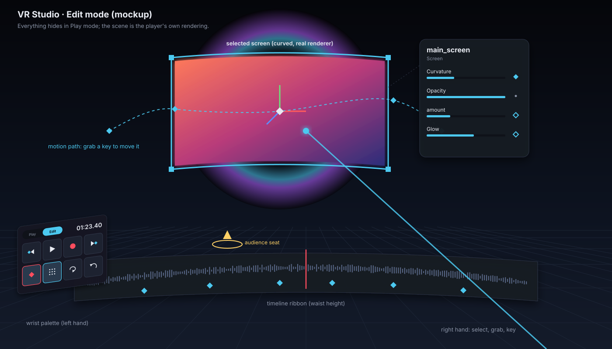
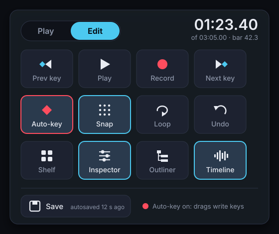
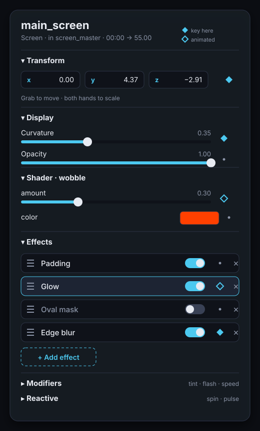
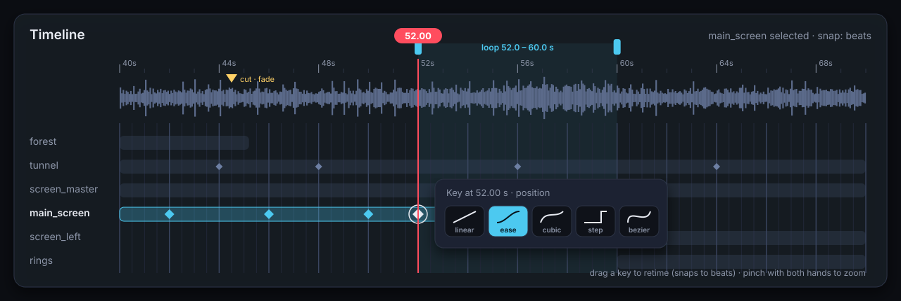
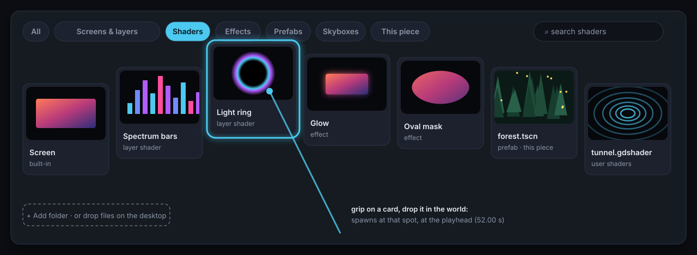

# VR Studio — Plan and handoff

Plan for a VR editor ("Studio") for VJ scripts: build and perform a piece from inside the headset. This records the decisions made so far, what's done, and the design and milestones for what comes next, so work can resume in a fresh session. The design is under *Studio design*.

Branch: `claude/sweet-bardeen-mjgzvk` (commits `8a44787`, `04f3be3`, `38e8d22` on top of `89d4579`).

## Decisions

1. **The script JSON is the master format**, not a Godot source project.
   - The VR editor runs on the player's own renderer, so what you see in the headset is what the player shows. That's the reason VR editing is worth doing at all.
   - The format is now lossless for animation (bezier handles, true cubic; see *Done*), which was the main argument against it.
   - It keeps the plan's founding goal: scripts can be edited by hand, diffed and shared as a zip, with no Godot install needed.
2. **A Godot scene is a view of the JSON, never a second master.**
   - Import only into an **empty project**; there is never any merging into an existing scene.
   - The imported scene's `output_path` points back at the JSON, so exporting writes the master.
   - Rule for artists: anything that must survive belongs in the JSON or inside a prefab. Loose scene furniture is lost on the next round trip.
3. **Studio is a separate app, but not a separate codebase.**
   - It has its own main scene and export preset in `project_engine/`, and shares the player's rendering core.
   - Dependencies go one way: `studio/` uses `player/stage/`, and nothing in `player/` references `studio/`.
   - Studio doesn't need DLNA, the playlist, Whirligig or live sync.
4. **Studio edits the JSON directly**, reusing the player's existing load, hot-reload and reconcile path. Live sync with the Godot editor isn't needed for it.

Rejected alternatives, and why:
- **Studio inside the addon, editing `.tscn` at runtime:** it would render with the addon's preview copies rather than the player, and saving a scene at runtime is risky (owners, instances, local-to-scene materials).
- **Merging a JSON into an existing scene:** it's a 3-way merge; not worth it.
- **Existing runtime-editor addons:** we checked Godot4xGizmo, 3D Gizmo Tool, DsInspector, Inspector Gadget, and the Godot editor running on Quest. None handle "change → keyframe at the current time → persist", and the Quest editor is standalone Android while gde_gozen is a Windows FFmpeg extension. Use **XR Tools** instead: `XRToolsPickable` for grabbing, `XRToolsInteractableHinge` / `Slider` / `Joystick` for knobs and faders, and `Viewport2DIn3D` for wrist panels.

## Done

### Script format v2 (`8a44787`)
- **Interpolation modes:** `interp` can be `linear` (default), `step`, `ease` (per-segment smoothstep), `cubic` or `bezier`.
  - `cubic` is Godot's time-aware Catmull-Rom (`cubic_interpolate_in_time`).
  - `bezier` keys carry `in` / `out` handles as `[dt, dv]` relative to the key, one pair per element for arrays. The player solves them exactly as Godot's `bezier_track_interpolate` does (10-step bisection).
- **v1 files still load:** their `cubic` is rewritten to `ease` on load (`ScriptFormat._upgrade`), because v1's cubic was a smoothstep. The player accepts versions 1–2; exporters write 2.
- **Exporter no longer bakes bezier tracks.** Where components have keys at different times, each curve is split exactly with de Casteljau; segments with flat handles export as `linear`.
  - Forest tunnel: 174 KB (2,080 keys) → 37 KB (175 keys), now exactly the editor's curves.
- **Previous mismatch fixed:** the player's `cubic` used to be a smoothstep while Godot's is a spline, so motion differed from the editor. They now match.
- **Tests:** `project_engine/tests/test_interpolation.gd` compares against Godot's own `Animation` interpolation (cubic within 1e-4, bezier within 1e-5).

### Importer and format gaps (`04f3be3`)
- **Importer:** `addon_vj/importer/script_importer.gd`, the exporter in reverse.
  - **Tools > VJ: Import script.json…** (or `importer/run_import.gd -- <json>` headless) writes `res://main.tscn`, makes it the main scene, and copies custom prefabs to `prefabs/` and shaders to `shaders/`.
  - It refuses a project that already has scenes outside `addons/`.
- **What converts exactly:** everything the exporter writes. Hand-written-only features are converted or dropped with a warning:
  - an `ease` track, or one mixing interpolations → Bezier tracks with equivalent handles (ease and cubic segments convert exactly)
  - `step` mixed with other modes → holds until 1 ms before the next key
  - an object respawned with a different config → keeps its first spawn's
  - cuts with different transitions → all get the first one's (the scene's viewer has one)
  - `vr_teleport`, top-level `objects` (the player ignores these too) and `media.audio` → dropped
- **Format gaps closed:**
  - Switched-off effects export as `"enabled": false`. The player skips them and doesn't count them in `effect<N>`.
  - A viewer start pose away from home (0, 2, 8) exports as a hard `vr_cut` at t=0.
- **Round-trip test:** `addon_vj/tests/run_roundtrip.gd` imports and exports every JSON in `scripts/` and `addon_vj/tests/fixtures/` twice. It fails if playback differs (every track sampled through the player's `Interpolation`) or the export changes on the second pass.
  - All pass, including a hand-written fixture that covers every conversion.
  - I broke the importer on purpose to confirm the test catches it.
  - Forest tunnel imported, saved to `.tscn`, reloaded and exported with 0 differences from the original.

## Studio design

### What it's for
Studio is where a piece gets **staged and performed**, rather than typed. It has to beat the desktop at what the desktop is bad at, and hand everything else back to it:

| VR is better at | How Studio uses it |
|---|---|
| Judging size, depth and curvature at true scale | Everything is placed by hand, in the audience's seat, on the real renderer |
| Timing to music | Performance recording: move things and turn knobs while the song plays |
| Seeing what the audience sees | Playback mode *is* the player: same video, audio reactivity and effects |
| Shaping motion in space | Motion paths drawn in 3D, with keys you grab and move |

**Left to the desktop:** fine timing across many tracks, typing names and numbers, writing shaders. The desktop route is import → edit → export in Godot (see *Done*); it round-trips losslessly.

### Principles
1. **Two modes, one button.** *Play* is the audience view with no UI. *Edit* shows the tools. Toggling is instant and keeps the playhead, so you can check anything straight away.
2. **Touch it to change it.** Grab objects directly. Every property sits next to the thing it changes. No mode maps to memorise.
3. **Time is always visible.** A playhead, the song's waveform with beats, and key markers are in view while editing, so you always know *when* a change lands.
4. **Nothing is destructive.** Unlimited undo/redo, autosave with versions, and every edit is one command on the JSON.
5. **Legible and comfortable.** Big targets, readable text, haptic confirmation, no forced movement, works seated or standing.

### Interface



*Mockups: these show layout and visual language, not final pixels. Their source is `docs/studio/*.svg`.*

**Hands.** The left hand holds the tools; the right hand acts. Left-handed users can swap.

| Input | Edit mode | Play mode |
|---|---|---|
| Right trigger | Select / press UI | Play / pause when aimed at a screen (as now) |
| Right grip | Grab the object under the ray or in the hand | Drag the floating panel (as now) |
| Both grips, empty hands | Move / turn / scale **yourself** relative to the world (world grab) | — |
| Grip + other hand's grip on the same object | Two-hand scale and rotate | — |
| Left stick | Fly (noclip, see *Moving around*) | Volume / seek (as now) |
| Right stick left/right | Snap turn (smooth turn as an option) | Seek ±10 s (as now) |
| Right stick up/down | Rise / sink; while grabbing: push / pull the object along the ray | — |
| Left trigger held + left stick | Scrub (left/right, further = faster); up/down steps to previous / next key | — |
| Right A | Key the selection at the playhead | Play / pause |
| Right B | Undo (hold: redo) | — |
| Left menu | Toggle Play / Edit | Toggle Play / Edit |

The mapping follows the current `xr_rig.gd` signals, so Play mode behaves exactly like today's player.

**Panels.** Each one is a `Viewport2DIn3D`, styled like the existing floating panel. All of them hide in Play mode.

- **Wrist palette** (left forearm, visible when you look at it). It has the mode toggle, the timecode, play/pause and record, **auto-key** on/off (a red ring means it's on), snapping on/off, undo/redo, and save. It also has buttons that open the other panels. It extends today's wrist HUD.
- **Timeline ribbon**: a wide, gently curved band at waist height (you can move it).
  - It shows the song's waveform with beat and bar ticks, `vr_cut` markers, the object's lanes (spawn → despawn bars) and key diamonds for the selection.
  - Grab the playhead to scrub. Pinch with both hands to zoom in time. Drag a diamond to retime a key (it snaps to beats when snapping is on).
  - Set a loop region (in/out handles) for rehearsing a passage.
- **Inspector**: follows the selected object at arm's length.
  - It's generated from the same shader hints the Camera tab already uses (`camera_tab._param_control`), so every hinted uniform gets a slider with no extra work. It covers transform, display (curvature, opacity), the effects stack (add from a menu, reorder by dragging, enable/disable, remove), modifiers and reactive.
  - Each property has a **key diamond**: filled means there's a key at the playhead, hollow means the property is animated, a dot means it's static. Tap the diamond to add or remove a key.
  - Colours get a hue/value wheel instead of three sliders.
- **Asset shelf**: a curved carousel of thumbnails you open from the wrist, organised by type. Grab a thumbnail and **drop it in the world** to spawn it there, at the playhead (see *Assets*).
- **Outliner**: the object tree (groups, screens, layers, prefabs), with visibility over time. Drag onto a group to parent. Rename with the system keyboard, or by voice later.

<p>


</p>





**Visual language.**
- Dark translucent panels, one accent colour for "selected / active" and one red for "recording / keying".
- Text is at least about 1.2° of view (roughly 2 cm at 1 m), and targets are at least about 2.5 cm.
- The pointer's hover highlights what will be hit. A short haptic tick confirms a key, a snap, a grab and a drop.
- The selected object gets an outline plus its pivot and axes. Objects that are animated but off-key show a faint ghost at their next key.

### Moving things around
- **Direct grab.** The grip takes whatever is in your hand or under the ray, with the grab offset kept, so it doesn't jump. Picking needs colliders: Studio adds a pick box around each spawned object's visual bounds, only in Studio (never in the player).
- **Two hands.** With both hands on an object, their distance scales it and their rotation turns it. The scale is uniform unless axis lock is on.
- **Snapping** (toggled on the wrist):
  - position to a 10 cm grid
  - rotation to 15°
  - "face the viewer": turn to face the audience seat
  - "level": zero roll
  - scale to 5% steps
  - align flush to the surface or screen under the ray

  Snapping shows as guides while you drag.
- **What a drag writes:**
  - **Auto-key on:** a transform key at the playhead (replacing a key at the same time).
  - **Auto-key off:** the object's spawn transform, for a static layout. This is the "set up the stage" mode.
  - The state is always visible (the red ring), and undo reverts either one.
- **World grab and miniature view.** Move and rotate yourself by gripping empty space. A **miniature** of the whole scene on a table lets you lay out big environments (tunnels, forests) from above, then drop back to full scale with one button.
- **Audience seat.** A marker shows the player's home pose (and the viewer's cut poses). One button puts you in that seat, which is the only honest place to judge a layout.

### Moving around while editing
Big pieces (tunnels, forests, screens spread around you) need you to go and look.
- **Noclip flight** (Edit mode). The left stick flies you where you look, *including* up and down, straight through anything (scenes have no collision anyway).
  - Speed follows stick deflection; hold the left grip for 4× boost.
  - The right stick turns (snap by default) and rises / sinks.
  - This extends the existing `XRMovement` free mode (which walks on the floor) with gaze-directed and vertical movement and a speed curve.
- **Comfort while flying:** a vignette fades in with speed, the horizon stays level (flying never tilts or rolls you), and acceleration is short and constant. There's also a "teleport" option for people who get sick from smooth motion: point, release, fade, arrive.
- **World grab and miniature** (see *Moving things around*) are the other two ways to move: grabbing is best for small precise shifts, the miniature for crossing a big scene.
- **Jump buttons** on the wrist:
  - **Seat**: back to the audience seat (the viewer's pose at the playhead).
  - **Go to selection**: fly to a comfortable viewing distance in front of the selected object.
  - **Back**: return to where you were before the last jump.
- **Play mode** doesn't use any of this: you are where the audience is (the seat, following cuts and viewer animation), unless you choose "watch from here".
- **Desktop:** the same flight with WASD + Q/E + mouse look, as the desktop camera and the addon's F5 preview already do.

### Keyframes and timing
- **Keying.** Use the inspector diamonds, A for the whole selection, or auto-key while dragging. Keys go into the JSON tracks the exporter already writes: `transform`, and `shader_param` with the `surface` / `layer` / `display` / `effect<N>` / `modifiers` / `reactive` slots.
- **Interpolation.** Pick per key on the ribbon: *linear, ease, cubic, step* or *bezier*, plus bezier presets (ease-in, ease-out, overshoot). Shape bezier handles on a curve view in the inspector for one property.
- **Performance recording** is the core advantage.
  1. Arm properties: the inspector's record dot, or "transform" by grabbing.
  2. Press record; playback starts from a pre-roll (default 2 s before the loop in-point).
  3. Move the object or turn the knob while the music plays.
  4. When you stop, the stream (sampled per frame) is thinned to keys within a tolerance (linear keys, or beziers for smooth moves) and replaces the keys in the recorded range.
  5. **Punch-in:** only the looped range is overwritten, so you can redo one passage until it's right.
- **Beat snap.** An offline pass over the song (reusing `AudioAnalyzer`'s spectrum) finds onsets and tempo, giving beat and bar ticks on the ribbon. Key times and drags snap to them. You can nudge the grid if the detection is off.
- **Motion paths.** The selection's position track is drawn as a 3D curve with a dot per key. Grab a dot to move that key in space. Bezier handles show as small arms you can bend. This is spatial curve editing, which is clumsy on a desktop.
- **Cuts.** "Cut here" puts a cut on the viewer track at the playhead, from your current head pose, with the transition chosen on the wrist (see *Animating the viewer*). Cuts show on the ribbon and as seat markers in the world.
- **Spawning over time.** Dropping an asset spawns it at the playhead. Its lane bar's ends on the ribbon are its spawn and despawn times, so drag them to change when it appears or goes.

### Animating the viewer
Today the script moves the viewer only by jumping (`vr_cut`, with an optional fade). The plan adds smooth, keyframed viewer motion: flights through the tunnel, slow drifts, rides.
- **What can be keyed:**
  - **Position**, with any interpolation.
  - **Yaw** (turning left/right).
  - **Pitch and roll** only for flat output (the desktop view and recordings). In the headset, tilting the world under someone is the fastest way to make them sick, and their own head already handles looking up and down. The player ignores pitch and roll in VR unless a comfort setting allows it.
  - **Field of view** can't be changed in a headset (the lenses fix it). It's keyable for flat output only.
- **How it plays:** keys move the XR origin (the room). The viewer's own head movement stays free on top of it, so they can still lean and look around while riding.
- **Cuts become part of the same track.** A cut is a *step* key with an optional fade. Old scripts' `vr_cut` events convert on load, and the exporter's viewer keys map straight onto it.
- **Comfort, enforced by the player:**
  - The Config tab's *Script camera* setting gains a middle option: **"cuts only"** turns smooth moves into fades at each key, for sensitive viewers.
  - The vignette fades in during fast viewer motion.
  - Studio shows a warning on the ribbon when a segment's speed or turn rate is above comfortable limits (roughly 3 m/s, 30°/s), so you know before an audience does.
- **Authoring in Studio:**
  - **Key viewer here**: stand (or fly) somewhere, look, press. It keys the viewer's position and yaw at the playhead. Pick the interpolation, or "cut", on the ribbon.
  - **Ride recording**: arm the viewer, press record, and fly the path in noclip while the music plays. It's thinned to keys like any recording.
  - **Viewer path in the world**: drawn as a motion path with a small camera marker at each key. Grab a marker to move it, or twist it to change the yaw.
  - **Preview a ride** in Play mode from the seat. That's the only honest comfort check.
- **In the Godot addon:** `VJViewer` gets a *motion* setting: "cuts" (today's behaviour) or "smooth" (its keys export as the viewer track, with their interpolation).

### Camera shaders
Full-view effects over everything the viewer sees: kaleidoscopes, colour cycling, liquid warps, bass-driven chromatic aberration, and later feedback trails.
- **How they render:** a quad glued in front of the camera (the same trick as today's `VRFade` fade quad) with a shader that reads the rendered image (`hint_screen_texture`) and writes a changed one.
  - This works in all of Godot's renderers and per eye in VR.
  - If the screen texture misbehaves with VR's two-eye rendering on the target headset, the fallback is a `CompositorEffect` (a compute pass on the final image). That's more work and needs the Forward+ renderer.
- **Writing one:** a `.gdshader` with a `// @camera` hint that includes `camera_prelude.gdshaderinc`. The prelude provides:
  - `view_color(uv)` to sample what's rendered
  - `eye` (0 left, 1 right)
  - `strength`: a master 0–1 amount every camera shader respects, so a fade in/out works for any of them
  - the same audio inputs as layers: `audio_bass` / `audio_mid` / `audio_high` / `audio_level`, and the spectrum texture

  They go in the same `shaders` folders as layers and effects, and show up in the picker. Shadertoy code works too, with a small wrapper where `iChannel1` is the rendered view.
- **Built-ins to start with:** kaleidoscope, hue cycle, liquid warp, chromatic pulse (on bass), posterize + edge glow, and "breathing" (a gentle zoom pulse). Each is sound-reactive with a sensible default.
- **Later:** *feedback trails* (blending in the previous frame for echoes and smears) need a history buffer, so they go through the `CompositorEffect` route. The same goes for chaining several camera shaders; v1 runs one at a time.
- **In the format:** a top-level `camera` block holds the effects list, in the same shape as a screen's effects (`shader`, `params`, `enabled`). Parameters animate with `shader_param` tracks on target `$camera.effect<N>`, so keying `strength` from 0 to 1 is how a trip starts and ends.
- **In the player:** the Camera tab gets a *Camera FX* row (pick a shader, strength, its hint sliders), saved in presets like layers. So plain videos get it too, not just scripts.
- **Comfort and safety:** these effects are the easiest way in the project to make someone ill or trigger photosensitivity.
  - **Same warp in both eyes.** Warps are computed from each eye's view centre, never differently per eye; mismatched eyes cause eye strain within seconds.
  - **User limits.** The Config tab gets a *Camera effects* setting: on / off / max strength. A script can't exceed it.
  - **Flash limit.** Built-ins keep large brightness flashes under 3 per second, and Studio warns on the ribbon when a keyed or reactive setting would exceed that.

### Configuring
- The inspector covers every `config` field the format has: shader and params, `render_scale` / `resolution`, curvature, opacity, effects (with `enabled`), modifiers (tint, flash, speed, sort offset), and reactive (spin, pulse).
- Changing a static value with auto-key off edits the spawn config. With auto-key on, it keys a `shader_param` track, like transforms.
- **Presets.** Save a configured object (prefab + config + effects) as a *look* to the asset shelf, and re-apply it to others. This extends the player's preset idea to objects.
- **Live audio.** The sound-reactive layers react to the real song while editing, so reactive settings are tuned by ear and eye at once.

### Assets
- **What the shelf shows:**
  - built-in screens, layers, cubes and groups
  - built-in layer shaders and effects (`VisualizerShaders.list_options`)
  - user shaders (`user://shaders`, `<exe>/shaders`)
  - custom prefabs (`.tscn` next to the piece or in a library folder)
  - skyboxes
  - the piece's own `prefabs/` and `shaders/`
- **Getting assets in:**
  - drop files on the desktop window (as the player already accepts)
  - pick from a folder browser on the wrist (the Files tab already exists)
  - add watch folders in settings; new files appear on the shelf live (the file watcher already exists)
  - a Shadertoy `.glsl` is wrapped as today
- **Self-contained pieces.** Pulling in a custom asset copies it into the piece folder (`prefabs/`, `shaders/`), the same way the exporter bundles them. A piece folder can then be zipped and shared.
- **Thumbnails.** Shaders and prefabs are rendered to small images offscreen (a few frames, with fake audio) and cached next to the asset. Shaders animate on hover.
- **Media.** Choose the piece's video from the browser. Its projection (flat, 180, 360) is detected as in the player.

### Playback mode
- Identical to the player: the same stage, video, audio analysis, effects, cuts and fades. There's no Studio UI and no pick boxes, and nothing is drawn that the audience wouldn't see.
- Starts from the playhead, or from the loop in-point with pre-roll. It can loop the region.
- **Seat.** It watches from the audience seat by default (with cuts applied). You can also watch from where you stand, free.
- **Speed 0.5× / 0.25×** for checking timing (video and animation stay in sync; audio pitch-shifted or muted).
- **Toggling back to Edit** keeps the playhead exactly, so "see a problem → fix it" is one button.
- The desktop window mirrors the headset. Optionally it shows a fixed spectator camera for recording demos.

### Saving and safety
- **One edit model.** All edits go through a command API on an in-memory copy of the JSON: add object, set config, set key, move key, delete, reparent, and so on. Each command knows how to undo itself. The runner is updated from the model:
  - incrementally for key and config changes (patch one track or node)
  - through the existing `_reconcile_swap` for structural ones (spawn, despawn, parent)
- **Saving.** Explicit save from the wrist, plus autosave every minute to `video.json.autosave` and a rotating `.bak` set.
- **External changes.** If the JSON changes on disk (a Godot export), Studio offers *reload* (you lose unsaved VR edits, with a warning) or *keep mine*.
- **Always valid.** Studio saves through the same validator (`ScriptFormat`) before writing, so it can't produce a file the player rejects.

### Format additions (v3)
- **Viewer track:** `transform` tracks with target `$viewer`, channels `position` and `rotation_deg` (plus a flat-output-only `fov`). A cut is a key with `"interp": "step"` and an optional `"transition": {"type": "fade_to_black", "duration": 1}`. v2 `vr_cut` events load as such keys.
- **Camera block:** top-level `"camera": {"effects": [{"shader", "params", "enabled"}]}`; tracks target `$camera.effect<N>`.
- Ids starting with `$` are reserved for these, so they can't collide with object names.

### Architecture
```
project_engine/
  player/
    stage/     ← extracted from main.gd: video, runner, screens/layers, audio, XR rig, cuts
    app/       ← the player shell (files, DLNA, playlist, whirligig, presets, menus)
  studio/
    studio.tscn           stage + studio rig + panels
    model/ edit_model.gd  JSON document + commands + undo stack (pure data, headless-testable)
    model/ key_thinning.gd, beat_detect.gd
    tools/  grab.gd, snap.gd, record.gd, motion_path.gd, cut_tool.gd
    ui/     wrist_palette, timeline_ribbon, inspector, asset_shelf, outliner (Viewport2DIn3D scenes)
    assets/ asset_library.gd, thumbnailer.gd
```
- Dependencies go one way: `studio/` uses `player/stage/`, and `player/` never references `studio/`.
- There's a separate export preset *Studio*; the *Player* preset excludes `studio/`.
- **Testable without a headset:** the edit model, key thinning, beat detection, snapping maths and asset import are pure logic with headless tests (in the same style as the existing suite). Each milestone also has a short headset checklist.

### Milestones
Each ends in something usable, with a clear "done when".

| # | Milestone | Done when |
|---|---|---|
| M0 | **Stage extraction** from `main.gd` (no behaviour change) | 137 tests pass; the player works unchanged on a headset |
| M1 | **Studio skeleton**: open a piece, Play/Edit toggle, save, undo/redo, edit model with tests | Open forest_tunnel, toggle modes, save → the file is byte-identical when nothing changed |
| M2 | **Select and move**: pick boxes, ray/direct grab, two-hand, snapping, auto-key, noclip flight, jump buttons, audience seat | Re-lay out moving_screen by hand, flying around it; auto-key keys play back right in the player |
| M3 | **Inspector**: hint-generated params, effects stack, key diamonds, colour wheel | Retune a screen's glow and add/reorder effects without touching the desktop |
| M4 | **Timeline ribbon**: waveform, lanes, key diamonds, retime, loop region, interpolation picker | Retime a key to a beat by dragging; loop a passage |
| M5 | **Asset shelf**: library, thumbnails, drag-to-spawn, bundling into the piece | Start from an empty piece and build a scene only from the shelf; the folder zips and plays elsewhere |
| M6 | **Performance recording + beat snap** | Record a knob sweep to the music, punch-in a fix, and it plays back tight |
| M7 | **Motion paths + viewer animation + miniature view**: format v3 viewer track, key viewer here, ride recording, comfort warnings, "cuts only" setting | Record a ride through the tunnel, preview it from the seat, and it plays back smooth in the player (and as fades with "cuts only") |
| M8 | **Polish**: haptics, comfort, visual pass, left-handed mode, looks/presets | A first-time user can place, key and play back a screen in 10 minutes unaided |

| FX | **Camera shaders** in the *player* (not Studio): camera quad + prelude + built-ins, Camera FX in the Camera tab and presets, format `camera` block, user limits | A kaleidoscope reacts to the bass on a plain video in the headset, the same in both eyes; strength keys in a script fade it in and out |

M1–M3 are the smallest thing that's already better than the desktop for layout. M6 is the feature that makes Studio worth opening.

**FX doesn't depend on Studio** and can be built any time, even before M0: it's a player feature, testable on the desktop first. Its first step is a headset check that `hint_screen_texture` works per eye with the quad approach.

### Prerequisites and risks
- **Phase 4b headset checklist:** the wrist HUD, and pointer clicks in every menu tab, aren't recorded as confirmed. Make pointer UI solid before M2.
- **Seeking back past a cut:** the player doesn't restore the camera when seeking back past a `vr_cut` or the t=0 start-pose cut. Studio scrubs constantly, so fix this in M1 (camera state from the latest cut at or before the playhead).
- **`_read_transform` in `script_runner.gd`:** it builds `Basis.from_euler(rot).scaled(scl)`. `scaled` scales on global axes, while nodes (and the importer) use rotation × local scale. With non-uniform scale plus rotation, what Studio writes wouldn't play back the same. Fix before M2 (with a test).
- **Performance with many edits:** a full reconcile per drag frame is too slow. The edit model has to patch the runner incrementally (M1 design point). Recording writes to a buffer and commits once at the end.
- **Readable UI in the headset:** the `Viewport2DIn3D` resolution and panel distance need tuning per headset. Budget time in M8, and check text size from M1 on.
- **Beat detection quality** varies by genre. The ribbon's grid must be adjustable by hand (tap tempo, offset).

- **Camera shaders in VR:** reading the screen texture in multiview (two-eye) rendering has to be confirmed on the target headset and renderer before building on it; the `CompositorEffect` fallback costs more. Full-view effects also cost GPU time at headset resolution and refresh rate, so each built-in needs a frame-time budget check.

### Open questions
- **Target headsets and runtime:** Quest over Link/Air Link via SteamVR/OpenXR, or Index/others? This decides the button labels and whether hand tracking is worth adding.
- **Where shared assets live:** one library folder per user, or per project?
- **Should Studio also open plain videos**, to start a new piece from a video file (create `clip.json` next to it)? I'd say yes. It's the natural "new piece" flow.

## Known issues
- All 137 player tests pass, as does the round-trip test.
- `scripts/forest_tunnel/video.json` is still a v1 export (bezier tracks baked to linear keys, within 0.001 of the curves). Its events match the current scene; re-export from the editor for the exact curves and format v2.
- `scripts/minimal` has no objects, so the exporter refuses it (by design). The round-trip test skips it.

## Working in the cloud container
- **No Godot preinstalled.** Download the project's version (4.7.1):
  `curl -sSL -o g.zip https://github.com/godotengine/godot/releases/download/4.7.1-stable/Godot_v4.7.1-stable_linux.x86_64.zip && unzip g.zip`
  Godot 4.4 silently drops parts of 4.7-saved scenes (`libraries/ =`, `unique_id=`); don't use it.
- **Player tests:** `cd project_engine && godot --headless --import && godot --headless --script res://tests/run.gd`. The XR Tools and gde_gozen errors in the output are expected (not installed here).
- **Round-trip test:** link the addon into an authoring project first (gitignored, like your Windows junctions): `ln -sfn ../../addon_vj project_script_example/addons/vj_editor`. Then `cd project_script_example && godot --headless --import && godot --headless --script res://addons/vj_editor/tests/run_roundtrip.gd`.
- **Stray `.import` edits:** headless `--import` rewrites a few `.import` files (gde_gozen icons, `effect_icon.svg.import`). Revert them with `git checkout` before committing. `.uid` files and `.godot/` are gitignored.
